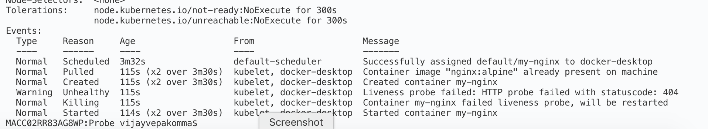

### 1. Apply the Pod

```sh
k delete -f HTTPLivenessProbeExample.yaml
k apply -f HTTPLivenessProbeExample.yaml
```
### 2. Delete Index Html

```sh
k exec my-nginx -it sh

ls /usr/share/nginx/html
rm  /usr/share/nginx/html/index.html
```

### 3. Check Events

```sh
k describe pod my-nginx
```

Expected output:
