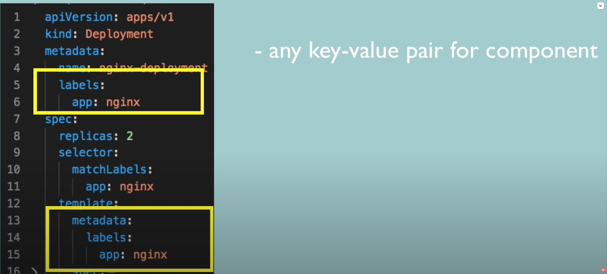
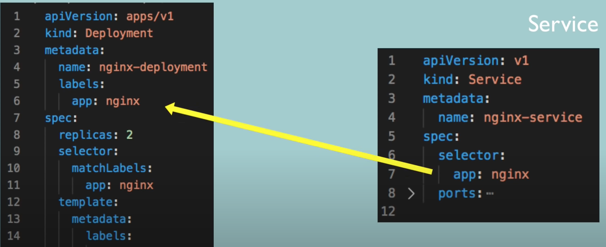
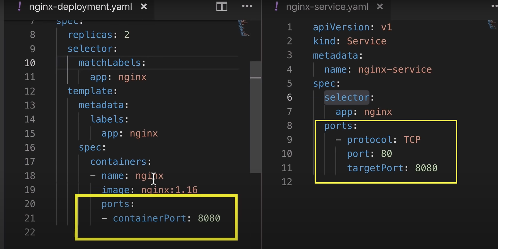

# Kubectl Config Overview

## Parts of Config File

- Metadata
- Specification
    - Different for Service/Deployment/etc
- Status (Desired vs Actual)
	- Not needed in specification of config but maintained by kubernetes
	- ETCD provides the status
 	- Compared with Spec and updated as needed

## YAML Best Practices
Use YAMLLint - online validator
Store Config with your Code


## Layers of Abstraction
- Deployment
- ReplicaSet
- Pod
- Container

## Pod Definition
Specified in DeploymentYaml: `spec/template`
- Template also has `metadata/ specification`
- Configuration within Configuration
- Applies to pod
- `template/spec` -> name of the container etc

## Matching Deployment and Pod

- For deployment, Define `labels` in `metadata`
- For pod, Define `labels` in `template/metadata`
- Tell the deployment to match by specific label using spec/selector/matchlabels




## Matching Service and Deployment

- For deployment, Define `labels` in `metadata`
- For service, add `spec/selector` with matching key value pair




## Forward Port from Service to Pod

- Define `spec/ports/targetPort` in service
- It must match `spec/template/spec/ports/containerPort `in deployment



### Verify Ports

- Get Service Ports
```sh
kubectl describe service nginx
```

- Get Pod Ports

```sh
kubectl get pod -o wide
``` 