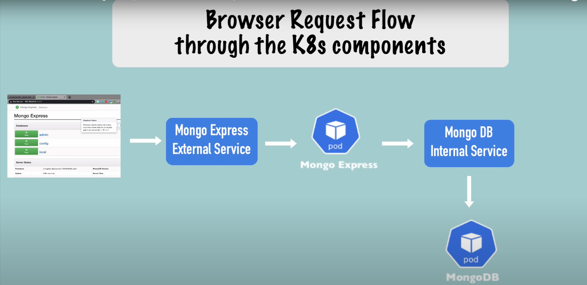
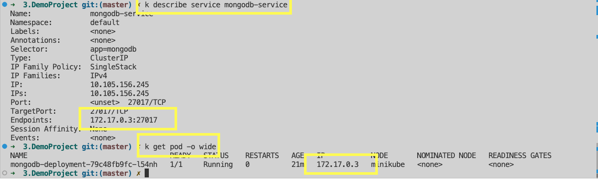
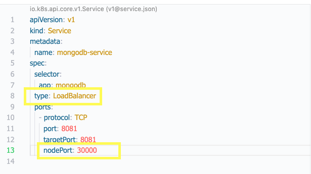

# Demo Project: MongoDB and MongoExpress 
## Desired Setup


## MongoDB Container
- Go to [hub.docker.com](https://hub.docker.com) and look for mongo
- Find Port used
- Find Environment Vars used 
    - Root username, Root password
    - Keep them blank in config
    - Add them as secrets in Kubernetes
    - Create secret before deployment
- Resource Limits: https://stackoverflow.com/a/64080587/474377 
- Base64 encode
    ```
	Echo -n 'username' | base64
	```

### Ensure service and pod are connected



## MongoDB Express
- Go to [hub.docker.com](https://hub.docker.com) and look for mongo-express
- Find Port used
- Find Env vars
    - MongoDB Admin Username
    - MongoDB Admin Password
    - MongoDB Server

Making a Service External
- Type: LoadBalancer
- nodePort: 30000-32767



- (Minikube specific) Assign external ip
Minikube service mongo-express-service
